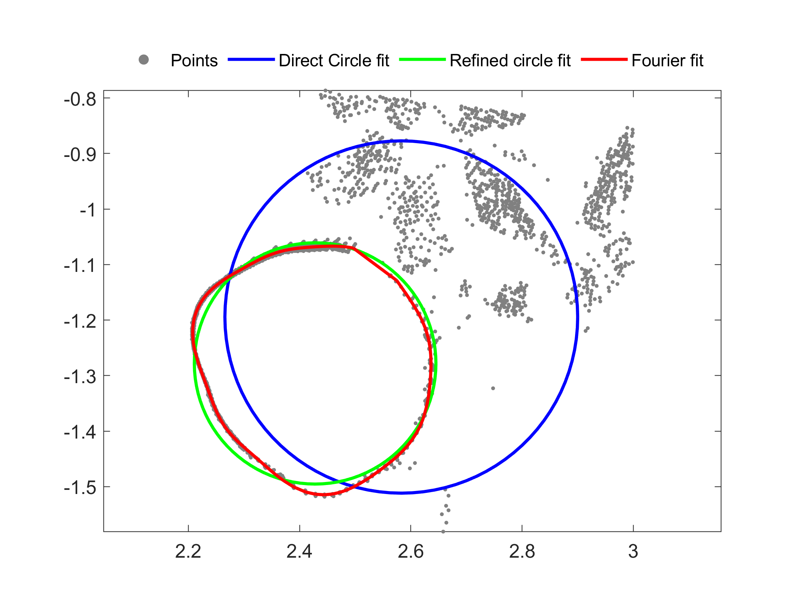
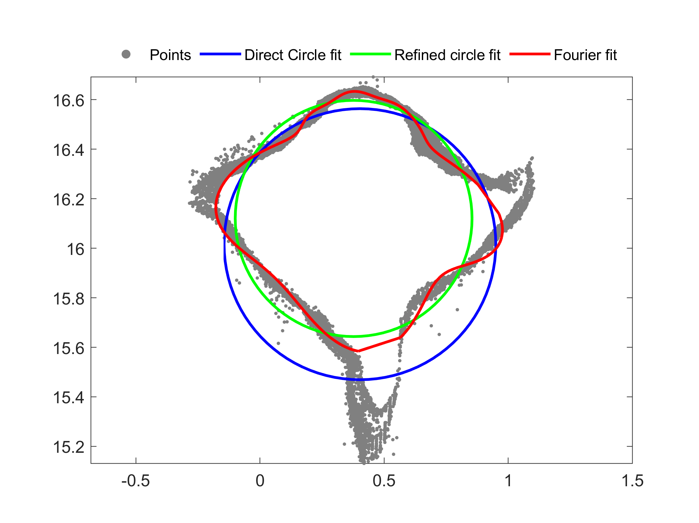
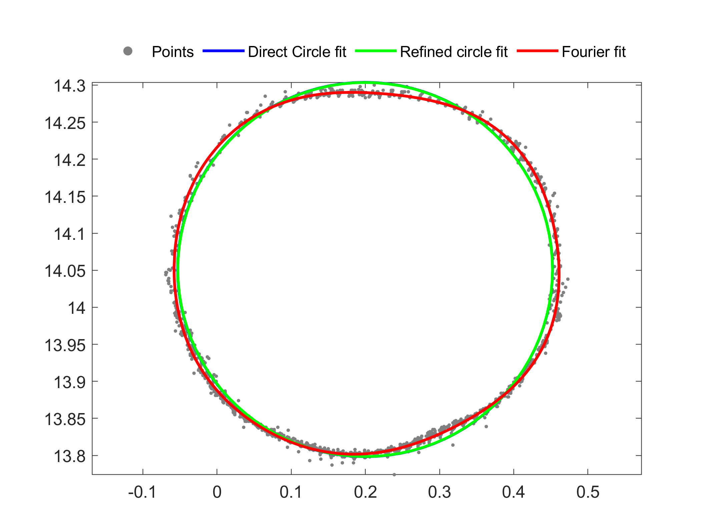
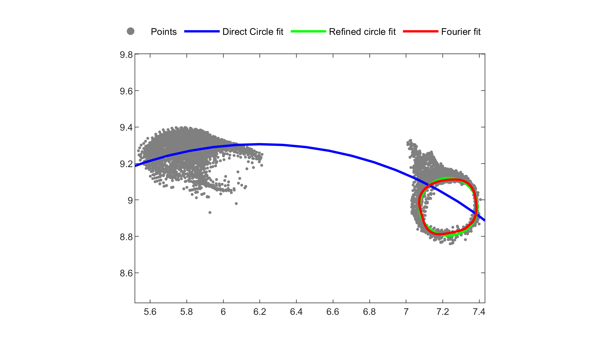

# TreeCrossSec
Tree stem cross-section reconstruction with free-form curves from point clouds
# Usage
VV = TreeCrossSec(Sp, res_thres, Forder)  

Input: 
Sp: nxm point cloud (unit in m). The dimension m should be at least 2. 
optional: 
res_thres: residual tolerance e.g., 0.01 (cm) 
Forder: Fourier series order (1 - 8) 

Output: 
VV: a structure variable contains diameter estimations from various methods, and reconstructed points in ModelX&ModelY. Usually FouCirc gives the best diameter estimation.

# Examples
Example 1  
VV = TreeCrossSec(Sp, 0.01, 8);

Example 2   
(this method only works perfectly for convex shapes)  
VV = TreeCrossSec(Sp, 0.05, 8);

Example 3  
VV = TreeCrossSec(Sp, 0.01, 6);

Example 4  
VV = TreeCrossSec(Sp, 0.01, 6);

# Bibtex
@article{xxxx,  
  title={Reconstructing stem cross section shapes from terrestrial laser scanning},  
  author={Wang, Di and Kankare, Ville and Puttonen, Eetu and Hollaus, Markus and Pfeifer, Norbert},  
  journal={IEEE Geoscience and Remote Sensing Letters},  
  volume={14},  
  number={2},  
  pages={272--276},  
  year={2017},  
  publisher={IEEE}  
}
# Contact
Di Wang  
di.wang@aalto.fi
